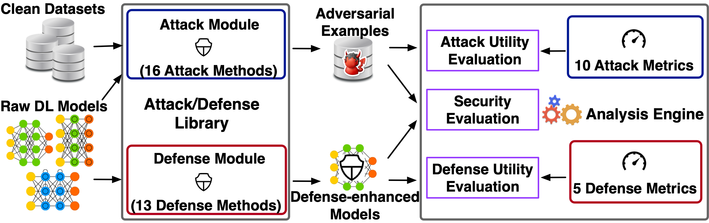

# DEEPSEC: A Uniform Platform for Security Analysis of Deep Learning Model

## 1. Description
DEEPSEC is the first implemented uniform evaluating and securing system for deep learning models, which comprehensively and systematically integrates the state-of-the-art adversarial attacks, defenses and relative utility metrics of them.

### 1.1 Citation:
> Xiang Ling, Shouling Ji, Jiaxu Zou, Jiannan Wang, Chunming Wu, Bo Li and Ting Wang, DEEPSEC: A Uniform Platform for Security Analysis of Deep Learning Models, IEEE S&P, 2019

### 1.2 Glance at the DEEPSEC Repo:

- `RawModels/` contains code used to train models and trained models will be attacked;
- `CleanDatasets/` contains code used to randomly select clean samples to be attacked;
- `Attacks/` contains the implementations of attack algorithms.
- `AdversarialExampleDatasets/` are collections of adversarial examples that are generated by all kinds of attacks;
- `Defenses/` contains the implementations of defense algorithms;
- `DefenseEnhancedModels/` are collections of defense-enhanced models (re-trained models);
- `Evaluations/` contains  code used to evaluate the utility of attacks/defenses and the security performance between attack and defenses.

### 1.3 Requirements:

Make sure you have installed all of following packages or libraries (including dependencies if necessary) in you machine:

1. PyTorch 0.4
2. TorchVision 0.2
3. numpy, scipy, PIL, skimage, tqdm ...
4. [Guetzli](https://github.com/google/guetzli): A Perceptual JPEG Compression Tool

### 1.4 Datasets:
We mainly employ two benchmark dataset MNIST and CIFAR10.

## 2. Usage/Experiments

### STEP 1. Training the raw models and preparing the clean samples
We firstly train and save the deep learning models for MNIST and CIFAR10 [here](./RawModels/), and then randomly select and save the clean samples that will be attacked [here](./CleanDatasets/).

### STEP 2. Generating adversarial examples
Taking the trained models and the clean samples as the input, we can generate corresponding adversarial examples for each kinds of adversarial attacks that we have implemented in [`./Attacks/`](./Attacks/), and we save these adversarial examples [here](./AdversarialExampleDatasets/).

### STEP 3. Preparing the defense-enhanced models
With the defense parameter settings, we obtain the corresponding defense-enhanced model from the original model for each kinds of defense methods that we have implemented in [`./Defenses/`](./Defenses/), and we save those re-trained defense-enhanced models into [here](./DefenseEnhancedModels/).

### STEP 4: Evaluation of Utility/Security Performance
After generating adversarial examples and obtained the defense-enhanced models, we evaluate the utility performance of attacks or defenses,respectively.
In addition, we can test the security performance between attacks and defenses, i.e., whether or to what extent the state-of-the-art defenses can defend against attacks. All codes can be found [`./Evaluations/`](./Evaluations/).

## 3. Update
If you want to contribute any new algorithms or updated implementation of existing algorithms, please also let us know.
> UPDATE: All codes have been re-constructed for better readability and adaptability.